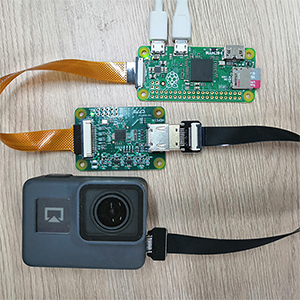

# Hardware

##Flight Controllers
* All supported Ardupilot boards including Pixhawk, APMx and Cube.
* Navio+ and Navio2

!!! note
    The Ardupilot project is often adding support for other flight controllers. The full list of supported flight controllers can be viewed [here](http://ardupilot.org/plane/docs/common-autopilots.html).

## Supported Raspberry Pi boards

* Pi0w
* PI 2
* Pi 3
* Pi 4

!!! warning
    Pi0w runs fine with UAVcast-Pro, however the CPU usage will be between 50 > 100%.
    If you intend to use other programs with UAVcast-Pro then Pi3 or 4 version is recommended.

##Extra power supply
It's important that Raspberry Pi gets voltage between 4.8 and 5.3v. If you use LTE modem, then external power supply is needed
to keep the voltage within the limits, otherwise the RPI could shutdown by itself.

This is one solution, where we attach the power directly to the USB +/- pins, and one wire to the RPI fuse. The latter will make sure RPI is booting automatically when powered.

!!! note
    Make sure you connect the modem to correct USB port where external power supply is connected.

## Modem
UAVcast uses modem manager and network manager to control the LTE connection.
Check out this page to find supported modems, [Supported modem](https://www.freedesktop.org/wiki/Software/ModemManager/SupportedDevices/)

**HiLink or Stick modems**

Some Huawei USB modems have a mode called "HiLink" which provides for "driverless" installation on Windows, Macintosh and Linux computers. These modems usually have the HiLink logo marked on the outside, or have letter H in the model name. **Example E3372H**.

Stick modems is a regular modem where you need to send AT commands to establish a cell connection. UAVcast has all the connection stuff you need integrate a stick modem.

**HiLink Advantages**

The big advantages being that the connection time is very fast and hassle free.
A HiLink modem uses a web browser to access the modem settings.

It acts more or less like a plug and play modem, you don't need to configure any parameters in UAVcast-Pro or Raspberry Pi.

**HiLink Disadvantages**

Hilink modems does not support Port Forwarding out of the box. You certainly almost every-time need to flash new firmware to access the Port Forwarding menu in the modem web interface.

However, if you use VPN connection then HiLink is a perfect choice as VPN does't not require any port forwarding.

## Camera
There are several cameras that works with UAVcast-Pro,

* PiCam
* Logitech C920
* Logitech C615
* GoPro. ([Can be used with HDMI to CSI converter](https://www.ebay.com/itm/1-Port-For-Raspberry-Pi-HDMI-To-CSI-2-Bridge-Adapter-Module-UP-To-1080p-25fps-/233297430162)). This allows users to record and view live stream simultaneously. 

    

* Supported GoPro cams:
    * HERO7 Black
    * HERO (2018)
    * HERO6 Black
    * HERO5 Black
    * HERO4 (Black and Silver Editions)
    * HERO3+ (Black and Silver Editions)
    * HERO3 (White, Silver, and Black Editions)
    * HERO2)
        * GoPro example video from one of our users.
        <iframe width="560" height="315" src="https://www.youtube.com/embed/4CNK3cBvUtg" frameborder="0" allow="accelerometer; autoplay; encrypted-media; gyroscope; picture-in-picture" allowfullscreen></iframe>

* Other cameras may also work. search for (camera type) and gStreamer.

<!-- PiCam is a perfect camera for this type application and provides 1080p video.
If you want to use another camera not listed, then make sure it has Hardware Encoder integrated to get the best quality. -->

[Mission Planner](http://ardupilot.org/planner/docs/mission-planner-installation.html) and [QGroundControl](http://qgroundcontrol.com/) supports video stream by default on port 5600.
